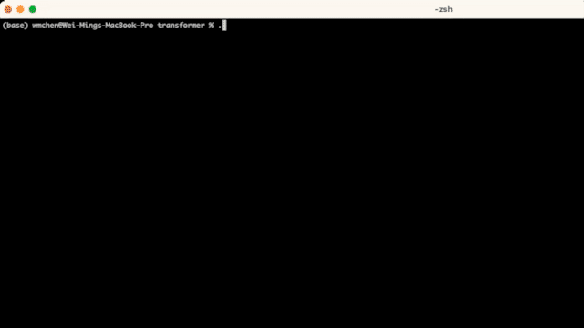

# TinyChatEngine: A Efficient Neural Network Library for LLM

TinyChatEngine is a powerful neural network library specifically designed for the efficient deployment of quantized large language models (LLMs) on edge devices.



## Prerequisites

### MacOS

For MacOS, install boost and llvm by

```bash
brew install boost
brew install llvm
```

For M1/M2 users, install Xcode from AppStore to enable the metal compiler for GPU support.

### Windows

For Windows, download and install the GCC compiler with MSYS2. Follow this tutorial: https://code.visualstudio.com/docs/cpp/config-mingw for installation.

- Install required dependencies with MSYS2

```
pacman -S --needed base-devel mingw-w64-x86_64-toolchain make unzip git
```

- Add binary directories (e.g., C:\\msys64\\mingw64\\bin and C:\\msys64\\usr\\bin) to the environment path

## Step-by-step to deploy LLaMA2-7B-chat with TinyChatEngine

Here, we provide step-by-step instructions to deploy LLaMA2-7B-chat with TinyChatEngine from scratch.

- Download the repo.
  ```bash
  git clone --recursive git@github.com:mit-han-lab/TinyChatEngine.git
  ```
- Download the quantized LLaMA2-7B-chat model from our model zoo.
  ```bash
  cd TinyChatEngine/llm
  ```
  - On an x86 device (e.g., Intel/AMD laptop)
    ```bash
    python tools/download_model.py --model LLaMA2_7B_chat_awq_int4 --QM QM_x86
    ```
  - On an ARM device (e.g., M1/M2 Macbook)
    ```bash
    python tools/download_model.py --model LLaMA2_7B_chat_awq_int4 --QM QM_ARM
    ```
  - On a CUDA device (e.g., Jetson AGX Orin)
    ```bash
    python tools/download_model.py --model LLaMA2_7B_chat_awq_int4 --QM QM_CUDA
    ```
- Compile and start the chat locally.
  ```bash
  make chat -j
  ./chat
  Using model: LLaMA7B_2_chat
  Using LLaMA's default data format: INT4
  Loading model... Finished!
  USER: Write a syllabus for Operating Systems.
  ASSISTANT:
  Of course! Here is a sample syllabus for a college-level course on operating systems:
  Course Title: Introduction to Operating Systems
  Course Description: This course provides an overview of the fundamental concepts and techniques used in modern operating systems, including process management, memory management, file systems, security, and I/O devices. Students will learn how these components work together to provide a platform for running applications and programs on a computer.
  Course Objectives:
  * Understand the basic architecture of an operating system
  * Learn about processes, threads, and process scheduling algorithms
  * Study memory management techniques such as paging and segmentation
  * Explore file systems including file organization, storage devices, and file access methods
  * Investigate security mechanisms to protect against malicious software attacks
  * Analyze input/output (I/O) operations and their handling by the operating system
  ...

  ```

## Backend support

| Precision | x86 (Intel/AMD CPU) | ARM (Apple M1/M2) | Nvidia GPU | Apple GPU |
| ------ | --------------------------- | --------- | --------- | --------- |
| FP32   |  ✅    |    ✅  |         |
| FP16   |     |      |         |
| W4A16  |      |      |  ✅  | ✅
| W4A32  |  ✅  |  ✅  |      | ✅
| W4A8   |  ✅  |  ✅  |      |
| W8A8   |  ✅  |  ✅  |      |

## Quantization and Model Support

The goal of TinyChatEngine is to support various quantization methods on various devices. For example, At present, it supports the quantized weights for int8 opt models that originate from [smoothquant](https://github.com/mit-han-lab/smoothquant) using the provided conversion script [opt_smooth_exporter.py](llm/opt_smooth_exporter.py). For LLaMA models, scripts are available for converting Huggingface format checkpoints to our int4 wegiht [format](llm/llama_exporter.py), and for quantizing them to specific methods [based on your device](llm/model_quantizer.py). Before converting and quantizing your models, it is recommended to apply the fake quantization from [AWQ](https://github.com/mit-han-lab/llm-awq) to achieve better accuracy. We are currently working on supporting more models, please stay tuned!

### Device-specific int4 Weight Reordering

To mitigate the runtime overheads associated with weight reordering, TinyChatEngine conducts this process offline during model conversion. In this section, we will explore the weight layouts of QM_ARM and QM_x86. These layouts are tailored for ARM and x86 CPUs, supporting 128-bit SIMD and 256-bit SIMD operations, respectively. We also support QM_CUDA for Nvidia GPUs, including server and edge GPUs.

| Platforms  | ISA | Quantization methods |
| ------------- | ------------- |  ------------- |
| Intel/AMD |  x86-64  | QM_x86  |
| Apple M1/M2 Mac | arm | QM_ARM  |
| Nvidia GPU| CUDA | QM_CUDA  |

- Example layout of QM_ARM: For QM_ARM, consider the initial configuration of a 128-bit weight vector, \[w0, w1, ... , w30, w31\], where each wi is a 4-bit quantized weight. TinyChatEngine rearranges these weights in the sequence  \[w0, w16, w1, w17, ..., w15, w31\] by interleaving the lower half and upper half of the weights. This new arrangement facilitates the decoding of both the lower and upper halves using 128-bit AND and shift operations, as depicted in the subsequent figure. This will eliminate runtime reordering overheads and improve performance.

## Download and deploy models from our Model Zoo

We offer a selection of models that have been tested with TinyChatEngine. These models can be readily downloaded and deployed on your device. To download a model, locate the target model's ID in the table below and use the associated script.

<table>
    <thead>
        <tr>
            <th>Models</th>
            <th>Precisions</th>
            <th>ID</th>
            <th>x86 backend</th>
            <th>ARM backend</th>
            <th>CUDA backend</th>
        </tr>
    </thead>
    <tbody>
        <tr>
            <td rowspan="2">LLaMA2_13B_chat</td>
            <td> fp32</td>
            <td> LLaMA2_13B_chat_fp32 </td>
            <td> ✅  </td>
            <td> ✅  </td>
            <td>  </td>
        </tr>
        <tr>
            <!-- No data for the first column here because it's merged with data1 -->
            <td>int4</td>
            <td>LLaMA2_13B_chat_awq_int4</td>
            <td> ✅ </td>
            <td> ✅ </td>
            <td> ✅ </td>
        </tr>
        <tr>
            <td rowspan="2">LLaMA2_7B_chat</td>
            <td>fp32</td>
            <td>LLaMA2_7B_chat_fp32 </td>
            <td> ✅  </td>
            <td> ✅  </td>
            <td>  </td>
        </tr>
        <tr>
            <!-- No data for the first column here because it's merged with data1 -->
            <td> int4</td>
            <td> LLaMA2_7B_chat_awq_int4</td>
            <td> ✅ </td>
            <td> ✅ </td>
            <td> ✅ </td>
        </tr>
        <tr>
            <td rowspan="2">LLaMA_7B</td>
            <td> fp32</td>
            <td> LLaMA_7B_fp32 </td>
            <td> ✅  </td>
            <td> ✅  </td>
            <td>  </td>
        </tr>
        <tr>
            <!-- No data for the first column here because it's merged with data1 -->
            <td>int4</td>
            <td>LLaMA_7B_awq_int4</td>
            <td> ✅ </td>
            <td> ✅ </td>
            <td> ✅ </td>
        </tr>
        <tr>
            <td rowspan="3">opt-6.7B</td>
            <td>fp32</td>
            <td>opt_6.7B_fp32</td>
            <td> ✅  </td>
            <td> ✅  </td>
            <td>  </td>
        </tr>
        <tr>
            <!-- No data for the first column here because it's merged with data1 -->
            <td>int8</td>
            <td>opt_6.7B_smooth_int8</td>
            <td> ✅  </td>
            <td> ✅  </td>
            <td>  </td>
        </tr>
        <tr>
            <!-- No data for the first column here because it's merged with data1 -->
            <td> int4</td>
            <td> opt_6.7B_awq_int4</td>
            <td> ✅  </td>
            <td> ✅  </td>
            <td>  </td>
        </tr>
        <tr>
            <td rowspan="3">opt-1.3B</td>
            <td>fp32</td>
            <td>opt_1.3B_fp32</td>
            <td> ✅  </td>
            <td> ✅  </td>
            <td>  </td>
        </tr>
        <tr>
            <!-- No data for the first column here because it's merged with data1 -->
            <td>int8</td>
            <td>opt_1.3B_smooth_int8</td>
            <td> ✅  </td>
            <td> ✅  </td>
            <td>  </td>
        </tr>
        <tr>
            <!-- No data for the first column here because it's merged with data1 -->
            <td> int4</td>
            <td> opt_1.3B_awq_int4</td>
            <td> ✅  </td>
            <td> ✅  </td>
            <td>  </td>
        </tr>
        <tr>
            <td rowspan="3">opt-125m</td>
            <td>fp32</td>
            <td>opt_125m_fp32</td>
            <td> ✅  </td>
            <td> ✅  </td>
            <td>  </td>
        </tr>
        <tr>
            <!-- No data for the first column here because it's merged with data1 -->
            <td>int8</td>
            <td>opt_125m_smooth_int8</td>
            <td> ✅  </td>
            <td> ✅  </td>
            <td>  </td>
        </tr>
        <tr>
            <!-- No data for the first column here because it's merged with data1 -->
            <td> int4</td>
            <td> opt_125m_awq_int4</td>
            <td> ✅  </td>
            <td> ✅  </td>
            <td>  </td>
        </tr>
    </tbody>
</table>

For instance, to download the quantized LLaMA-2-7B-chat model: (for int4 models, use --QM  to choose the quantized model for your device)

- On an Intel/AMD latptop:
  ```bash
  python tools/download_model.py --model LLaMA2_7B_chat_awq_int4 --QM QM_x86
  ```
- On an M1/M2 Macbook:
  ```bash
  python tools/download_model.py --model LLaMA2_7B_chat_awq_int4 --QM QM_ARM
  ```
- On an Nvidia GPU:
  ```bash
  python tools/download_model.py --model LLaMA2_7B_chat_awq_int4 --QM QM_CUDA
  ```

To deploy a quantized model with TinyChatEngine, compile and run the chat program.

```
make chat -j
./chat <model_name> <precision>
```

## Experimental features

TinyChatEngine offers versatile capabilities suitable for various applications. Additionally, we introduce a sophisticated voice chatbot. Explore our step-by-step guide [here](llm/application/README.md) to seamlessly deploy a chatbot locally on your device!

## Related Projects

[TinyEngine](https://github.com/mit-han-lab/tinyengine)

[Smoothquant](https://github.com/mit-han-lab/smoothquant)

[AWQ: Activation-aware Weight Quantization for LLM Compression and Acceleration](https://github.com/mit-han-lab/llm-awq)

## Acknowledgement

[llama.cpp](https://github.com/ggerganov/llama.cpp)

[whisper.cpp](https://github.com/ggerganov/whisper.cpp)

[transformers](https://github.com/huggingface/transformers)
