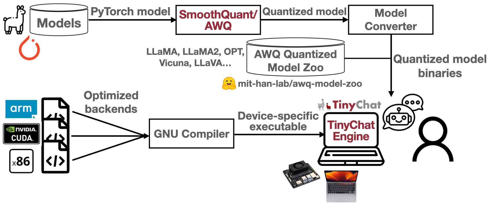

# TinyChatEngine: On-Device LLM Inference Library

Running large language models (LLMs) on the edge is useful: copilot services (coding, office, smart reply) on laptops, cars, robots, and more. Users can get instant responses  with better privacy, as the data is local.

This is enabled by LLM model compression technique: [SmoothQuant](https://github.com/mit-han-lab/smoothquant) and [AWQ (Activation-aware Weight Quantization)](https://github.com/mit-han-lab/llm-awq), co-designed with TinyChatEngine that implements the compressed low-precision model. 

Feel free to check out our [slides](assets/slides.pdf) for more details!

### Code LLaMA Demo on an NVIDIA GeForce RTX 4070 laptop:


### VILA Demo on an Apple MacBook Pro (M1, 2021):


### LLaMA Chat Demo on an Apple MacBook Pro (M1, 2021):


## Overview
### LLM Compression: SmoothQuant and AWQ
[SmoothQuant](https://github.com/mit-han-lab/smoothquant): Smooth the activation outliers by migrating the quantization difficulty from activations to weights, with a mathematically equal transformation (100\*1 = 10\*10).


[AWQ (Activation-aware Weight Quantization)](https://github.com/mit-han-lab/llm-awq): Protect salient weight channels by analyzing activation magnitude as opposed to the weights.

### LLM Inference Engine: TinyChatEngine
- **Universal**: x86 (Intel/AMD), ARM (Apple M1/M2, Raspberry Pi), CUDA (Nvidia GPU).
- **No library dependency**: From-scratch C/C++ implementation.
- **High performance**: Real-time on Macbook & GeForce laptop.
- **Easy to use**: Download and compile, then ready to go!




## News

- **(2024/02)** 🔥We extended the support for vision language models (VLM). Feel free to try running [VILA](#deploy-vision-language-model-vlm-chatbot-with-tinychatengine) on your edge device.
<!-- - **(2024/01)** 🔥We released TinyVoiceChat, a voice chatbot that can be deployed on your edge devices, such as MacBook and Jetson Orin Nano. Check out our [demo video](https://youtu.be/Bw5Dm3aWMnA?si=CCvZDmq3HwowEQcC) and follow the [instructions](#deploy-speech-to-speech-chatbot-with-tinychatengine-demo) to deploy it on your device! -->
- **(2023/10)** We extended the support for the coding assistant [Code Llama](#download-and-deploy-models-from-our-model-zoo). Feel free to check out.
- **(2023/10)** ⚡We released the new CUDA backend to support Nvidia GPUs with compute capability >= 6.1 for both server and edge GPUs. Its performance is also speeded up by ~40% compared to the previous version. Feel free to check out!


## Prerequisites

### MacOS

For MacOS, install boost and llvm by

```bash
brew install boost
brew install llvm
```

For M1/M2 users, install Xcode from AppStore to enable the metal compiler for GPU support.

### Windows with CPU

For Windows, download and install the GCC compiler with MSYS2. Follow this tutorial: https://code.visualstudio.com/docs/cpp/config-mingw for installation.

- Install required dependencies with MSYS2

```
pacman -S --needed base-devel mingw-w64-x86_64-toolchain make unzip git
```

- Add binary directories (e.g., C:\\msys64\\mingw64\\bin and C:\\msys64\\usr\\bin) to the environment path

### Windows with Nvidia GPU (Experimental)

- Install CUDA toolkit for Windows ([link](https://developer.nvidia.com/cuda-toolkit)). When installing CUDA on your PC, please change the installation path to another one that does not include "spaces".

- Install Visual Studio with C and C++ support: Follow the [Instruction](https://learn.microsoft.com/en-us/cpp/build/vscpp-step-0-installation?view=msvc-170).

- Follow the instructions below and use x64 Native Tools Command Prompt from Visual Studio to compile TinyChatEngine. 


## Step-by-step to Deploy LLaMA2-7B-chat with TinyChatEngine

Here, we provide step-by-step instructions to deploy LLaMA2-7B-chat with TinyChatEngine from scratch.

- Download the repo.
  ```bash
  git clone --recursive https://github.com/mit-han-lab/TinyChatEngine
  cd TinyChatEngine
  ```

- Install Python Packages
  - The primary codebase of TinyChatEngine is written in pure C/C++. The Python packages are only used for downloading (and converting) models from our model zoo.
    ```bash
    conda create -n TinyChatEngine python=3.10 pip -y
    conda activate TinyChatEngine
    pip install -r requirements.txt
    ```
- Download the quantized LLaMA2-7B-chat model from our model zoo.
  ```bash
  cd llm
  ```
  - On an x86 device (e.g., Intel/AMD laptop)
    ```bash
    python tools/download_model.py --model LLaMA2_7B_chat_awq_int4 --QM QM_x86
    ```
  - On an ARM device (e.g., M1/M2 Macbook, Raspberry Pi)
    ```bash
    python tools/download_model.py --model LLaMA2_7B_chat_awq_int4 --QM QM_ARM
    ```
  - On a CUDA device (e.g., Jetson AGX Orin, PC/Server)
    ```bash
    python tools/download_model.py --model LLaMA2_7B_chat_awq_int4 --QM QM_CUDA
    ```
  - Check this [table](#download-and-deploy-models-from-our-model-zoo) for the detailed list of supported models
- *(CUDA only)* Based on the platform you are using and the compute capability of your GPU, modify the Makefile accordingly. If using Windows with Nvidia GPU, please modify `-arch=sm_xx` in [Line 54](llm/Makefile#L54). If using other platforms with Nvidia GPU, please modify `-gencode arch=compute_xx,code=sm_xx` in [Line 60](llm/Makefile#L60). 
- Compile and start the chat locally.
  ```bash
  make chat -j
  ./chat

  TinyChatEngine by MIT HAN Lab: https://github.com/mit-han-lab/TinyChatEngine
  Using model: LLaMA2_7B_chat
  Using AWQ for 4bit quantization: https://github.com/mit-han-lab/llm-awq
  Loading model... Finished!
  USER: Write a syllabus for Operating Systems.
  ASSISTANT:
  Of course! Here is a sample syllabus for a college-level course on operating systems:
  Course Title: Introduction to Operating Systems
  Course Description: This course provides an overview of the fundamental concepts and techniques used in modern operating systems, including process management, memory management, file systems, security, and I/O devices. Students will learn how these components work together to provide a platform for running applications and programs on a computer.
  Course Objectives:
  * Understand the basic architecture of an operating system
  * Learn about processes, threads, and process scheduling algorithms
  * Study memory management techniques such as paging and segmentation
  * Explore file systems including file organization, storage devices, and file access methods
  * Investigate security mechanisms to protect against malicious software attacks
  * Analyze input/output (I/O) operations and their handling by the operating system
  ...
  ```


<!-- ## Deploy speech-to-speech chatbot with TinyChatEngine [[Demo]](https://youtu.be/Bw5Dm3aWMnA?si=CCvZDmq3HwowEQcC)

TinyChatEngine offers versatile capabilities suitable for various applications. Additionally, we introduce a sophisticated voice chatbot. Here, we provide very easy-to-follow instructions to deploy speech-to-speech chatbot (LLaMA2-7B-chat) with TinyChatEngine. 

- Follow the instructions above to setup the basic environment, i.e., [Prerequisites](#prerequisites) and [Step-by-step to Deploy LLaMA2-7B-chat with TinyChatEngine](#step-by-step-to-deploy-llama2-7b-chat-with-tinychatengine).

- Run the shell script to set up the environment for speech-to-speech chatbot.
  ```bash
  cd llm
  ./voicechat_setup.sh
  ```

- Start the speech-to-speech chat locally.
  ```bash
  ./voicechat  # chat.exe -v on Windows
  ```

- If you encounter any issues or errors during setup, please explore [here](llm/application/README.md) to follow the step-by-step guide to debug.
 -->

## Deploy vision language model (VLM) chatbot with TinyChatEngine

TinyChatEngine supports not only LLM but also VLM. We introduce a sophisticated text/voice chatbot for VLM. Here, we provide easy-to-follow instructions to deploy vision language model chatbot (VILA-7B) with TinyChatEngine. We recommend using M1/M2 MacBooks for this VLM feature.

- Follow the instructions above to setup the basic environment, i.e., [Prerequisites](#prerequisites) and [Step-by-step to Deploy LLaMA2-7B-chat with TinyChatEngine](#step-by-step-to-deploy-llama2-7b-chat-with-tinychatengine).

- To demonstrate images in the terminal, please download and install the following toolkit.
  - Install [termvisage](https://github.com/AnonymouX47/termvisage).
  - (For MacOS) Install [iTerm2](https://iterm2.com/index.html).
  - (For other OS) Please refer to [here](https://github.com/AnonymouX47/termvisage?tab=readme-ov-file#requirements) to get the appropriate terminal ready.

<!-- - (Optional) To enable the speech-to-speech chatbot for VLM, please follow the [instruction above](#deploy-speech-to-speech-chatbot-with-tinychatengine-demo) to run the shell script to set up the environment.
  ```bash
  cd llm
  ./voicechat_setup.sh
  ``` -->

- Download the quantized VILA-7B model from our model zoo.

  - On an x86 device (e.g., Intel/AMD laptop)
    ```bash
    python tools/download_model.py --model VILA_7B_awq_int4_CLIP_ViT-L --QM QM_x86
    ```
  - On an ARM device (e.g., M1/M2 Macbook, Raspberry Pi)
    ```bash
    python tools/download_model.py --model VILA_7B_awq_int4_CLIP_ViT-L --QM QM_ARM
    ```

- (For MacOS) Start the chatbot locally. Please use an appropriate terminal (e.g., iTerm2).
  - Image/Text to text
    ```bash
    ./vila ../assets/figures/vlm_demo/pedestrian.png
    ```

  <!-- - Image/Speech to speech
    ```bash
    ./voice_vila ../assets/figures/vlm_demo/pedestrian.png
    ``` -->

    - There are several images under the path `../assets/figures/vlm_demo`. Feel free to try different images with VILA on your device!

  <!-- - For other OS, please modify Line 4 in [vila.sh](llm/scripts/vila.sh) and [voice_vila.sh](llm/scripts/voice_vila.sh) to use the correct terminal. -->
  - For other OS, please modify Line 4 in [vila.sh](llm/scripts/vila.sh) to use the correct terminal.

## Backend Support

| Precision | x86<br /> (Intel/AMD CPU) | ARM<br /> (Apple M1/M2 & RPi) | Nvidia GPU | Apple GPU |
| ------ | --------------------------- | --------- | --------- | --------- |
| FP32   |  ✅    |    ✅  |         |
| W4A16  |      |      |  ✅  | ✅
| W4A32  |  ✅  |  ✅  |      | ✅
| W4A8   |  ✅  |  ✅  |      |
| W8A8   |  ✅  |  ✅  |      |

- For Raspberry Pi, we recommend using the board with 8GB RAM. Our testing was primarily conducted on Raspberry Pi 4 Model B Rev 1.4 with aarch64. For other versions, please feel free to try it out and let us know if you encounter any issues.
- For Nvidia GPU, our CUDA backend can support Nvidia GPUs with compute capability >= 6.1. For the GPUs with compute capability < 6.1, please feel free to try it out but we haven't tested it yet and thus cannot guarantee the results.

## Quantization and Model Support

The goal of TinyChatEngine is to support various quantization methods on various devices. For example, At present, it supports the quantized weights for int8 opt models that originate from [smoothquant](https://github.com/mit-han-lab/smoothquant) using the provided conversion script [opt_smooth_exporter.py](llm/tools/opt_smooth_exporter.py). For LLaMA models, scripts are available for converting Huggingface format checkpoints to our int4 wegiht [format](llm/tools/llama_exporter.py), and for quantizing them to specific methods [based on your device](llm/tools/model_quantizer.py). Before converting and quantizing your models, it is recommended to apply the fake quantization from [AWQ](https://github.com/mit-han-lab/llm-awq) to achieve better accuracy. We are currently working on supporting more models, please stay tuned!

### Device-specific int4 Weight Reordering

To mitigate the runtime overheads associated with weight reordering, TinyChatEngine conducts this process offline during model conversion. In this section, we will explore the weight layouts of QM_ARM and QM_x86. These layouts are tailored for ARM and x86 CPUs, supporting 128-bit SIMD and 256-bit SIMD operations, respectively. We also support QM_CUDA for Nvidia GPUs, including server and edge GPUs.

| Platforms  | ISA | Quantization methods |
| ------------- | ------------- |  ------------- |
| Intel & AMD |  x86-64  | QM_x86  |
| Apple M1/M2 Mac & Raspberry Pi | ARM | QM_ARM  |
| Nvidia GPU| CUDA | QM_CUDA  |

- Example layout of QM_ARM: For QM_ARM, consider the initial configuration of a 128-bit weight vector, \[w0, w1, ... , w30, w31\], where each wi is a 4-bit quantized weight. TinyChatEngine rearranges these weights in the sequence  \[w0, w16, w1, w17, ..., w15, w31\] by interleaving the lower half and upper half of the weights. This new arrangement facilitates the decoding of both the lower and upper halves using 128-bit AND and shift operations, as depicted in the subsequent figure. This will eliminate runtime reordering overheads and improve performance.

## Download and Deploy Models from our Model Zoo

We offer a selection of models that have been tested with TinyChatEngine. These models can be readily downloaded and deployed on your device. To download a model, locate the target model's ID in the table below and use the associated script.

<table>
    <thead>
        <tr>
            <th>Models</th>
            <th>Precisions</th>
            <th>ID</th>
            <th>x86 backend</th>
            <th>ARM backend</th>
            <th>CUDA backend</th>
        </tr>
    </thead>
    <tbody>
        <tr>
            <td rowspan="2">LLaMA2_13B_chat</td>
            <td> fp32</td>
            <td> LLaMA2_13B_chat_fp32 </td>
            <td> ✅  </td>
            <td> ✅  </td>
            <td>  </td>
        </tr>
        <tr>
            <!-- No data for the first column here because it's merged with data1 -->
            <td>int4</td>
            <td>LLaMA2_13B_chat_awq_int4</td>
            <td> ✅ </td>
            <td> ✅ </td>
            <td> ✅ </td>
        </tr>
        <tr>
            <td rowspan="2">LLaMA2_7B_chat</td>
            <td>fp32</td>
            <td>LLaMA2_7B_chat_fp32 </td>
            <td> ✅  </td>
            <td> ✅  </td>
            <td>  </td>
        </tr>
        <tr>
            <!-- No data for the first column here because it's merged with data1 -->
            <td> int4</td>
            <td> LLaMA2_7B_chat_awq_int4</td>
            <td> ✅ </td>
            <td> ✅ </td>
            <td> ✅ </td>
        </tr>
        <tr>
            <td rowspan="2">LLaMA_7B</td>
            <td> fp32</td>
            <td> LLaMA_7B_fp32 </td>
            <td> ✅  </td>
            <td> ✅  </td>
            <td>  </td>
        </tr>
        <tr>
            <!-- No data for the first column here because it's merged with data1 -->
            <td>int4</td>
            <td>LLaMA_7B_awq_int4</td>
            <td> ✅ </td>
            <td> ✅ </td>
            <td> ✅ </td>
        </tr>
        <tr>
            <td rowspan="2">CodeLLaMA_13B_Instruct</td>
            <td> fp32</td>
            <td> CodeLLaMA_13B_Instruct_fp32 </td>
            <td> ✅  </td>
            <td> ✅  </td>
            <td>  </td>
        </tr>
        <tr>
            <!-- No data for the first column here because it's merged with data1 -->
            <td>int4</td>
            <td>CodeLLaMA_13B_Instruct_awq_int4</td>
            <td> ✅ </td>
            <td> ✅ </td>
            <td> ✅ </td>
        </tr>
        <tr>
            <td rowspan="2">CodeLLaMA_7B_Instruct</td>
            <td> fp32</td>
            <td> CodeLLaMA_7B_Instruct_fp32 </td>
            <td> ✅  </td>
            <td> ✅  </td>
            <td>  </td>
        </tr>
        <tr>
            <!-- No data for the first column here because it's merged with data1 -->
            <td>int4</td>
            <td>CodeLLaMA_7B_Instruct_awq_int4</td>
            <td> ✅ </td>
            <td> ✅ </td>
            <td> ✅ </td>
        </tr>
        <tr>
            <td rowspan="2">VILA-7B</td>
            <td> fp32</td>
            <td> VILA_7B_CLIP_ViT-L_fp32 </td>
            <td> ✅  </td>
            <td> ✅  </td>
            <td>  </td>
        </tr>
        <tr>
            <!-- No data for the first column here because it's merged with data1 -->
            <td> int4</td>
            <td> VILA_7B_awq_int4_CLIP_ViT-L </td>
            <td> ✅  </td>
            <td> ✅  </td>
            <td>  </td>
        </tr>
        <tr>
            <td rowspan="2">LLaVA-v1.5-13B</td>
            <td> fp32</td>
            <td> LLaVA_13B_CLIP_ViT-L_fp32 </td>
            <td> ✅  </td>
            <td> ✅  </td>
            <td>  </td>
        </tr>
        <tr>
            <!-- No data for the first column here because it's merged with data1 -->
            <td> int4</td>
            <td> LLaVA_13B_awq_int4_CLIP_ViT-L </td>
            <td> ✅  </td>
            <td> ✅  </td>
            <td>  </td>
        </tr>
        <tr>
            <td rowspan="2">LLaVA-v1.5-7B</td>
            <td> fp32</td>
            <td> LLaVA_7B_CLIP_ViT-L_fp32 </td>
            <td> ✅  </td>
            <td> ✅  </td>
            <td>  </td>
        </tr>
        <tr>
            <!-- No data for the first column here because it's merged with data1 -->
            <td> int4</td>
            <td> LLaVA_7B_awq_int4_CLIP_ViT-L </td>
            <td> ✅  </td>
            <td> ✅  </td>
            <td>  </td>
        </tr>
        <tr>
            <td rowspan="2">StarCoder</td>
            <td> fp32</td>
            <td> StarCoder_15.5B_fp32 </td>
            <td> ✅  </td>
            <td> ✅  </td>
            <td>  </td>
        </tr>
        <tr>
            <!-- No data for the first column here because it's merged with data1 -->
            <td>int4</td>
            <td>StarCoder_15.5B_awq_int4</td>
            <td> ✅ </td>
            <td> ✅ </td>
            <td>  </td>
        </tr>
        <tr>
            <td rowspan="3">opt-6.7B</td>
            <td>fp32</td>
            <td>opt_6.7B_fp32</td>
            <td> ✅  </td>
            <td> ✅  </td>
            <td>  </td>
        </tr>
        <tr>
            <!-- No data for the first column here because it's merged with data1 -->
            <td>int8</td>
            <td>opt_6.7B_smooth_int8</td>
            <td> ✅  </td>
            <td> ✅  </td>
            <td>  </td>
        </tr>
        <tr>
            <!-- No data for the first column here because it's merged with data1 -->
            <td> int4</td>
            <td> opt_6.7B_awq_int4</td>
            <td> ✅  </td>
            <td> ✅  </td>
            <td>  </td>
        </tr>
        <tr>
            <td rowspan="3">opt-1.3B</td>
            <td>fp32</td>
            <td>opt_1.3B_fp32</td>
            <td> ✅  </td>
            <td> ✅  </td>
            <td>  </td>
        </tr>
        <tr>
            <!-- No data for the first column here because it's merged with data1 -->
            <td>int8</td>
            <td>opt_1.3B_smooth_int8</td>
            <td> ✅  </td>
            <td> ✅  </td>
            <td>  </td>
        </tr>
        <tr>
            <!-- No data for the first column here because it's merged with data1 -->
            <td> int4</td>
            <td> opt_1.3B_awq_int4</td>
            <td> ✅  </td>
            <td> ✅  </td>
            <td>  </td>
        </tr>
        <tr>
            <td rowspan="3">opt-125m</td>
            <td>fp32</td>
            <td>opt_125m_fp32</td>
            <td> ✅  </td>
            <td> ✅  </td>
            <td>  </td>
        </tr>
        <tr>
            <!-- No data for the first column here because it's merged with data1 -->
            <td>int8</td>
            <td>opt_125m_smooth_int8</td>
            <td> ✅  </td>
            <td> ✅  </td>
            <td>  </td>
        </tr>
        <tr>
            <!-- No data for the first column here because it's merged with data1 -->
            <td> int4</td>
            <td> opt_125m_awq_int4</td>
            <td> ✅  </td>
            <td> ✅  </td>
            <td>  </td>
        </tr>
    </tbody>
</table>

For instance, to download the quantized LLaMA-2-7B-chat model: (for int4 models, use --QM  to choose the quantized model for your device)

- On an Intel/AMD latptop:
  ```bash
  python tools/download_model.py --model LLaMA2_7B_chat_awq_int4 --QM QM_x86
  ```
- On an M1/M2 Macbook:
  ```bash
  python tools/download_model.py --model LLaMA2_7B_chat_awq_int4 --QM QM_ARM
  ```
- On an Nvidia GPU:
  ```bash
  python tools/download_model.py --model LLaMA2_7B_chat_awq_int4 --QM QM_CUDA
  ```

To deploy a quantized model with TinyChatEngine, compile and run the chat program.

- On CPU platforms
```bash
make chat -j
# ./chat <model_name> <precision> <num_threads>
./chat LLaMA2_7B_chat INT4 8
```

- On GPU platforms
```bash
make chat -j
# ./chat <model_name> <precision>
./chat LLaMA2_7B_chat INT4
```


## Related Projects

[TinyEngine: Memory-efficient and High-performance Neural Network Library for Microcontrollers](https://github.com/mit-han-lab/tinyengine)

[SmoothQuant: Accurate and Efficient Post-Training Quantization for Large Language Models](https://github.com/mit-han-lab/smoothquant)

[AWQ: Activation-aware Weight Quantization for LLM Compression and Acceleration](https://github.com/mit-han-lab/llm-awq)


## Acknowledgement

[llama.cpp](https://github.com/ggerganov/llama.cpp)

[whisper.cpp](https://github.com/ggerganov/whisper.cpp)

[transformers](https://github.com/huggingface/transformers)
